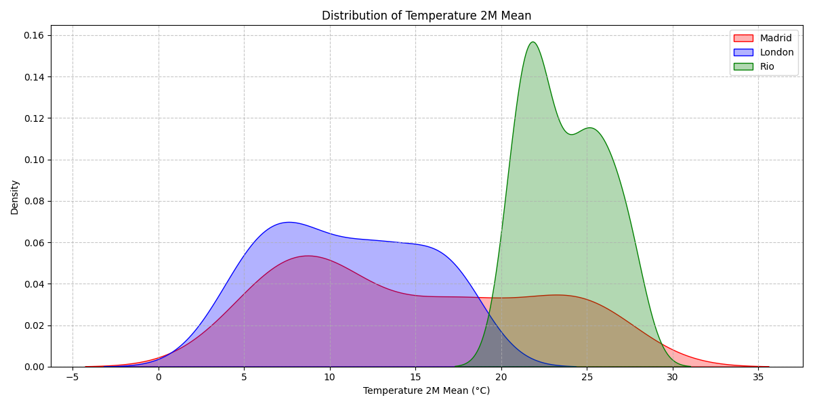
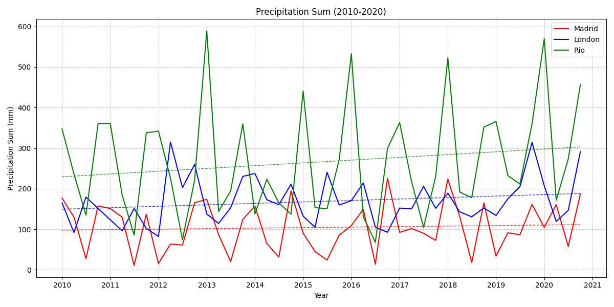

# Professional Weather Data Integration & Visualization

[](https://www.python.org/downloads/)
[](https://github.com/psf/black)
[](https://mypy-lang.org/)
[](https://flake8.pycqa.org/)

> **🎯 Focus**: Professional API integration patterns, development environment setup, and production-ready Python practices.

## Overview

This module demonstrates enterprise-grade Python development practices through a weather data analysis pipeline. Built as part of the **Zrive Applied Data Science Program**, it showcases robust API integration, comprehensive error handling, and professional development workflows.

**Key Technical Achievements:**
- **Robust API Client**: Implementing retry logic, rate limiting, and response validation
- **Modular Architecture**: Clean separation of concerns following SOLID principles
- **Production Patterns**: Comprehensive logging, type safety, and error handling
- **Quality Assurance**: Unit testing, linting, formatting, and type checking
- **Data Processing**: Advanced temporal resampling and multi-city comparative analysis

---

## 🏗️ Architecture & Design Decisions

### API Integration Layer (`api_utils.py`)
```python
def api_call(url: str, params: JSONType, max_retries: int = 3, backoff_factor: float = 1.0) -> JSONType | None:
```
- **Exponential backoff** for failed requests
- **Rate limit handling** (HTTP 429) with intelligent retry delays
- **Request timeout** protection and connection error recovery
- **Response validation** with schema checking to detect API contract changes

### Data Processing Pipeline (`module_1_meteo_api.py`)
- **Temporal resampling** from daily to quarterly resolution for trend analysis
- **Enhanced metrics calculation**: temperature ranges, rainy days, windy days
- **Moving averages** for trend analysis (3-month and 12-month windows)
- **City ranking system** for comparative analysis across locations

### Visualization Engine (`plotting.py`)
- **Multi-dimensional analysis**: Time series, seasonal patterns, correlations, and distributions
- **Hemisphere-aware seasonal analysis** (accounting for Rio's Southern Hemisphere seasons)
- **Statistical trend lines** with polynomial regression
- **Professional styling** with consistent color schemes and grid layouts

---

## 📊 Sample Results

### Temperature Distribution Analysis
The analysis reveals distinct climate patterns across three continents:



**Key Insights:**
- **Rio de Janeiro**: Tropical climate with consistent 20-25°C range and minimal variation
- **Madrid**: Continental climate showing broader temperature distribution (0-30°C)
- **London**: Maritime climate with moderate temperatures concentrated around 10-15°C

### Precipitation Patterns (2010-2020)


The decade-long precipitation analysis shows:
- **Rio**: High variability with seasonal peaks reaching 600mm (summer months)
- **London**: Consistent moderate precipitation (~150-200mm) throughout the year
- **Madrid**: Lowest precipitation with occasional spikes during winter months

---

## 🚀 Quick Start

### Prerequisites
- Python 3.11+
- Poetry for dependency management
- Git for version control

### Installation & Setup
```bash
# Clone and navigate to the module
git clone git@github.com:Riemann-def/zrive-ds.git
cd src/module_1

# Install dependencies with Poetry
poetry install

# Activate virtual environment
poetry shell
# Run the analysis
poetry run python -m module_1_meteo_api.py
```

### Expected Output
```
2023-01-15 10:30:45 - meteo-logger - INFO - Starting weather data analysis
2023-01-15 10:30:46 - meteo-logger - INFO - Fetching data for Madrid
2023-01-15 10:30:47 - meteo-logger - INFO - Making API request to https://archive-api.open-meteo.com/v1/archive
2023-01-15 10:30:48 - meteo-logger - INFO - Fetching data for London
2023-01-15 10:30:49 - meteo-logger - INFO - Fetching data for Rio
2023-01-15 10:30:50 - meteo-logger - INFO - Processing data
2023-01-15 10:30:51 - meteo-logger - INFO - Creating visualizations
2023-01-15 10:30:52 - meteo-logger - INFO - All plots have been saved to ./src/module_1/plots/
2023-01-15 10:30:52 - meteo-logger - INFO - Analysis complete
```

---

## 🛠️ Development Practices

### Code Quality Pipeline
This project implements industry-standard development practices:

```bash
# Code formatting (Black)
poetry run black src/

# Linting (Flake8)
poetry run flake8 src/

# Type checking (MyPy)
poetry run mypy src/

# Unit testing (Pytest)
poetry run pytest tests/ -v
```

### Key Testing Strategies
- **API mocking** to avoid external dependencies during testing
- **Parametrized tests** for validating multiple frequency resampling options
- **Edge case handling** (empty inputs, invalid cities, malformed responses)
- **Integration testing** with realistic data structures

```python
@patch("src.module_1.module_1_meteo_api.api_call")
@patch("src.module_1.module_1_meteo_api.validate_meteo_api_response")
def test_get_data_meteo_api_success(mock_validate, mock_api_call):
    # Professional mocking patterns for external API dependencies
```

### Configuration Management
- **Environment-specific settings** through centralized config
- **Type-safe constants** with proper Python typing
- **Modular imports** for easy testing and maintainability

---

## 🔧 Technical Specifications

**API Endpoint**: [Open-Meteo Historical Weather API](https://open-meteo.com/en/docs/historical-weather-api)

**Data Coverage**:
- **Temporal Range**: 2010-2020 (10 years)
- **Resolution**: Daily data aggregated to quarterly periods
- **Geographic Coverage**: 3 cities across 3 continents
- **Variables**: Temperature, precipitation, wind speed

**Dependencies**:
- `requests` - HTTP client with retry logic
- `pandas` - Data manipulation and temporal resampling
- `matplotlib` + `seaborn` - Professional visualizations
- `numpy` - Statistical computations

**Development Tools**:
- `poetry` - Dependency management and virtual environments
- `black` - Code formatting
- `flake8` - Linting and style checking
- `mypy` - Static type checking
- `pytest` - Testing framework with mocking capabilities

---

## 📈 Performance Considerations

- **Efficient API calls** with connection pooling and timeout handling
- **Memory optimization** through pandas vectorized operations
- **Lazy evaluation** for large datasets using generators where applicable
- **Graceful degradation** when API endpoints are unavailable

---

*This module serves as the foundation for the Zrive Applied Data Science Program, establishing professional development practices that will be built upon in subsequent modules focusing on exploratory data analysis, statistical learning, and model deployment.*