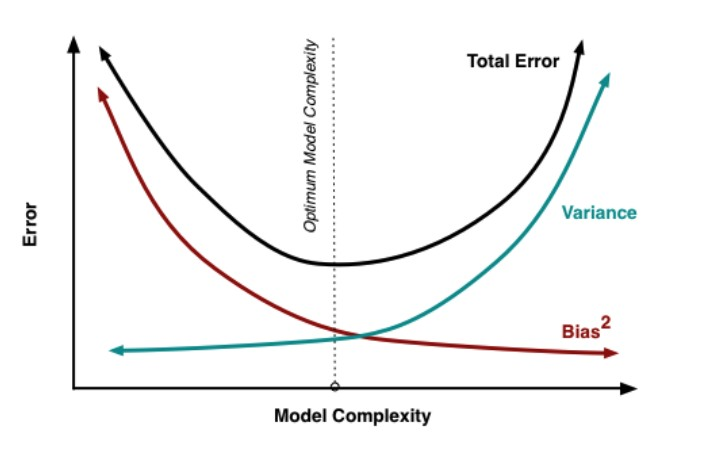

# Statistical Learning Fundamentals & Push Notification Prediction

[](https://www.python.org/downloads/)
[](https://pandas.pydata.org/)
[](https://jupyter.org/)


This module represents a deep dive into the fundamentals of statistical learning, where theory meets real-world business applications. We built a machine learning pipeline to predict customer purchase behavior for targeted push notifications, learning that **model selection is ultimately a business decision, not just a technical one**.

## 🎯 Business Problem

We're building a system that predicts whether users will purchase specific products to send them targeted push notifications. The challenge? Our app's push notifications currently have only a **5% open rate**, making relevance crucial.

**The Business Trade-off:**
- 📲 **False Positives**: Send notifications to users who won't buy → User fatigue, potential app uninstalls
- 💰 **False Negatives**: Miss users who would buy → Lost revenue opportunities

This isn't just about accuracy—it's about **translating model metrics into business euros**.

## 📊 The Bias-Variance Trade-off

One of the key concepts we explored is the fundamental bias-variance trade-off in machine learning:



### Understanding the Trade-off

- **High Bias (Underfitting)**: Model is too simple, misses underlying patterns
- **High Variance (Overfitting)**: Model is too complex, learns noise instead of signal
- **Sweet Spot**: Finding the optimal model complexity for best generalization

### Regularization as Complexity Control

We implemented two key regularization techniques:

**Ridge Regression (L2)**
```
Loss = MSE + α × Σ(βᵢ²)
```
- Shrinks all coefficients toward zero
- Keeps all features but reduces their impact
- Good when all features are somewhat relevant

**Lasso Regression (L1)**
```
Loss = MSE + α × Σ|βᵢ|
```
- Can set some coefficients exactly to zero
- Performs automatic feature selection
- Ideal when only subset of features matter

## 🏗️ Technical Implementation

### Data Pipeline Architecture
Our production-ready pipeline includes:

1. **Data Filtering**: Only orders with 5+ items (business requirement)
2. **Feature Engineering**: 
   - Date features extraction (year, month, day of year, weekend indicator)
   - Categorical encoding (frequency encoding vs. target encoding)
3. **Model Training**: Logistic regression with class weight optimization
4. **Model Versioning**: Robust system for tracking model versions and performance

### Encoding Strategies Compared

We tested different categorical encoding approaches:

| Encoding Type | Use Case | Pros | Cons |
|---------------|----------|------|------|
| **Frequency Encoding** | High cardinality | Simple, fast | Loses semantic meaning |
| **Target Encoding** | High cardinality + predictive | Preserves target relationship | Risk of overfitting |
| **One-Hot Encoding** | Low cardinality | Preserves all information | Memory intensive |

### Data Splitting Strategy

We implemented **GroupShuffleSplit** to prevent data leakage:
- **70% Training** - Model learning
- **20% Validation** - Hyperparameter tuning and model selection  
- **10% Test** - Final unbiased evaluation

**Key**: Never split products from the same order across different sets!

## 📈 Business-Driven Metric Selection

### Why Precision Matters Most

For our push notification system, we prioritized **precision over recall**:

```python
# F-beta score with β=0.3 (precision-focused)
f_beta = (1 + 0.3²) × precision × recall / (0.3² × precision + recall)
```

**Business Reasoning:**
- Each irrelevant notification increases user fatigue
- 95% of notifications are already ignored
- Better to send fewer, highly relevant notifications
- Preserves the effectiveness of this marketing channel

### Model Selection Results

| Model | Precision | Recall | F₀.₃ Score | Business Impact |
|-------|-----------|--------|------------|-----------------|
| **Target Encoding + Custom Weights** | 30.6% | 8.2% | **0.250** | 🎯 **Selected** |
| Frequency Encoding + Balanced | 28.4% | 9.0% | 0.242 | High notification volume |
| Random Forest | 37.4% | 6.7% | 0.272 | Non-linear (rejected for interpretability) |

**Winner**: Target Encoding with class weights `{0: 1, 1: 5}` - Best balance of precision and recall for our business case.

## 🔧 Production-Ready Features

### Model Versioning System
```python
# Automatic versioning with metadata tracking
version = f"v_{timestamp}"
metadata = {
    "performance": test_metrics,
    "model_info": pipeline_details,
    "parameters": training_config
}
Config.register_model(version, metadata)
```

### Inference Pipeline
```bash
# Train and select best model
poetry run python -m src.module_3.main

# Make predictions on new data
poetry run python -m src.module_3.predict data/new_customers.csv
```

### Key Design Decisions

1. **Symbolic Links**: Active model points to best performing version
2. **Metadata Storage**: Complete tracking of model lineage and performance
3. **Configuration Management**: Centralized settings for reproducibility
4. **Error Handling**: Robust pipeline with comprehensive logging

## 💡 Key Learnings

### Technical Insights
- **Linear models** can be highly effective with proper feature engineering
- **Class weighting** is crucial for imbalanced datasets
- **Feature encoding** choice significantly impacts model performance
- **Cross-validation strategy** must respect data dependencies

### Business Insights
- **Model selection is a business decision**: Technical metrics must align with business objectives
- **Context matters**: A 30% precision model might be excellent or terrible depending on use case
- **Trade-offs are inevitable**: Perfect recall and perfect precision don't coexist
- **Production readiness**: Code organization and versioning are as important as model performance

## 🚀 Next Steps

This module establishes the foundation for more advanced topics:
- **Module 4**: Advanced model deployment and MLOps
- **Module 5**: Model monitoring and drift detection
- **Module 6**: A/B testing and business impact measurement


## 🎓 Concepts Mastered

- **Statistical Learning Theory**: Bias-variance trade-off, overfitting prevention
- **Linear Models**: Logistic regression, regularization techniques (Ridge/Lasso)
- **Feature Engineering**: Date processing, categorical encoding strategies
- **Model Selection**: Business-metric optimization, validation strategies
- **Production MLOps**: Model versioning, inference pipelines, configuration management

---

*"Data Science is not just about programming—it's about making decisions that drive business value."*