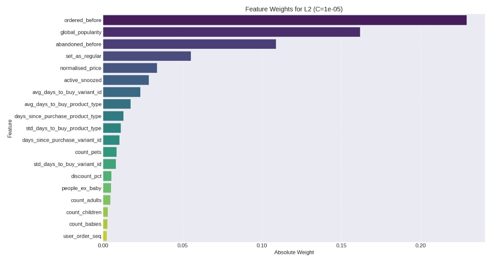
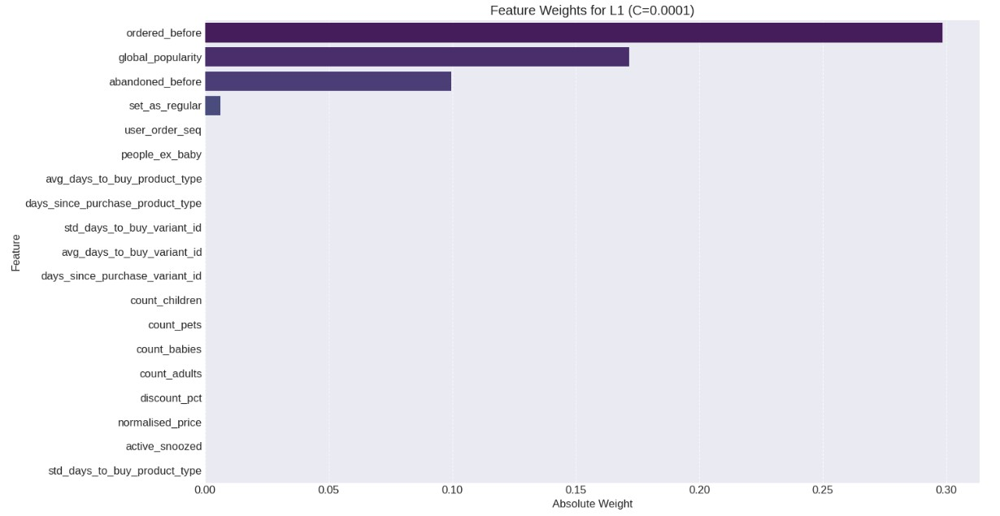
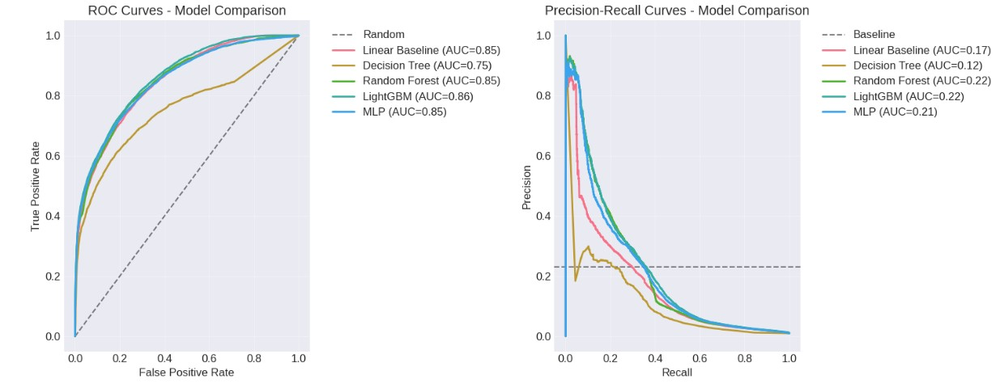

# Advanced Statistical Learning & Non-Linear Models for Push Notifications

[](https://www.python.org/downloads/)
[](https://pandas.pydata.org/)
[](https://lightgbm.readthedocs.io/)
[](https://scikit-learn.org/)

This module extends the statistical learning foundations from Module 3 by exploring **non-linear models** to improve push notification targeting. We've evolved from linear approaches to sophisticated ensemble methods and neural networks, demonstrating that **model complexity should match problem complexity**.

## 🎯 Enhanced Business Problem

Building on our Module 3 foundation, we're now tackling the push notification challenge with advanced modeling techniques. Our goal remains unchanged: predict customer purchase behavior for targeted notifications while maintaining business-focused metrics.

**Key Improvements from Module 3:**
- 📊 **Better Baseline**: Added global popularity baseline to justify ML model usage
- 🎯 **Improved Metrics**: Switched from F0.3 score to **AUC-PR** for better interpretability
- 🔄 **Advanced Models**: Explored Decision Trees, Random Forest, Boosting, and Neural Networks
- ⚖️ **Business Focus**: Maintained precision-first approach for notification relevance

## 📈 Methodology Evolution

### From Linear to Non-Linear

**Module 3 Foundation:**
- Linear models with regularization (Ridge/Lasso)
- Feature engineering and encoding strategies
- Business-driven metric selection (F0.3 → AUC-PR)

**Module 4 Advancement:**
- **Decision Trees**: Interpretable non-linear relationships
- **Ensemble Methods**: Random Forest and Gradient Boosting
- **Neural Networks**: Deep learning baseline exploration
- **Model Comparison**: Comprehensive evaluation across all families

### Why AUC-PR Over F0.3?

For our **highly imbalanced dataset** (~1.2% positive class), we switched to AUC-PR because:
- More interpretable than F0.3 score
- Better suited for imbalanced problems than ROC-AUC
- Threshold-independent evaluation
- Easier to communicate to stakeholders

## 🛠️ Technical Implementation

### Baseline Strategy

```python
class PopularityBaseline:
    def __init__(self, threshold=0.05, popularity_col='global_popularity'):
        self.threshold = threshold
        self.popularity_col = popularity_col
    
    def predict_proba(self, X):
        proba_pos = X[self.popularity_col] / X[self.popularity_col].max()
        return np.column_stack([1 - proba_pos, proba_pos])
```

**Purpose**: Establish that ML models must outperform simple business logic.

### Model Architecture Explored

#### 1. Decision Trees
- **Grid Search**: 96 parameter combinations
- **Best Configuration**: max_depth=15, criterion='entropy'
- **AUC-PR**: 0.2448 (baseline improvement)

#### 2. Random Forest
- **Ensemble Power**: 200 estimators, max_depth=6
- **AUC-PR**: 0.2164
- **Training Time**: ~58s (acceptable for production)

#### 3. LightGBM (Winner 🏆)
- **Gradient Boosting**: Optimized hyperparameters
- **Best AUC-PR**: 0.2230
- **Configuration**: learning_rate=0.005, n_estimators=500
- **Production Ready**: Fast inference, robust performance

#### 4. Neural Networks
- **Architecture**: (64, 32) hidden layers
- **AUC-PR**: 0.2094 (baseline performance)
- **Insight**: Linear relationships dominate this problem

### Feature Importance Analysis

From our best models, key features consistently emerged:

| Feature | Importance | Business Insight |
|---------|------------|------------------|
| **ordered_before** | Highest | Previous purchase behavior is strongest predictor |
| **global_popularity** | High | Popular products drive purchases |
| **abandoned_before** | Medium | Cart abandonment signals hesitation |
| **set_as_regular** | Medium | Subscription behavior indicates loyalty |




## 📊 Model Performance Comparison



### Final Results

| Model | ROC-AUC | **PR-AUC** | Training Time | Production Ready |
|-------|---------|------------|---------------|------------------|
| Popularity Baseline | 0.70 | 0.07 | <1s | ✅ |
| Linear (Module 3) | 0.85 | **0.17** | ~5s | ✅ |
| Decision Tree | 0.75 | 0.12 | ~8s | ✅ |
| Random Forest | 0.85 | 0.22 | ~58s | ✅ |
| **LightGBM** | **0.86** | **0.22** | ~27s | ✅ **Selected** |
| Neural Network | 0.85 | 0.21 | ~45s | ⚠️ |

**Winner**: LightGBM with optimal balance of performance, interpretability, and speed.

## 🏗️ Production Pipeline

### Model Training

```python
def handler_fit(event, _):
    params = validate_event(event, "model_parametrisation")
    filtered_df = load_feature_frame(DATA_PATH)
    X_train, X_test, y_train, y_test = temporal_train_test_split(filtered_df)
    
    model = PushModel(params).fit(X_train, y_train)
    model_path = model.save()
    
    return {
        "statusCode": 200,
        "body": json.dumps({"model_path": str(model_path)})
    }
```

### Model Inference

```python
def handler_predict(event, _):
    users_dict = validate_event(event, "users") 
    users_df = get_users_df(users_dict)
    
    model = PushModel.load(PushModel.latest_model_path())
    predictions = model.predict(users_df)
    
    return {
        "statusCode": 200,
        "body": json.dumps({"prediction": predictions.to_dict()})
    }
```

### Key Design Decisions

1. **Temporal Splitting**: Maintains chronological order to prevent data leakage
2. **Model Versioning**: Automatic timestamped model saves
3. **Robust Error Handling**: Production-ready exception management
4. **Threshold Optimization**: Business-metric driven threshold selection (0.3039)

## 💡 Key Learnings & Insights

### Technical Discoveries
- **Non-linear gains are marginal**: Linear relationships dominate this dataset
- **Ensemble methods shine**: Random Forest and LightGBM outperform single models
- **Feature engineering > model complexity**: Good features beat complex models
- **Business metrics matter**: AUC-PR provides clearer business insights than F-scores

### Business Insights
- **Model selection is contextual**: Best technical metrics ≠ best business outcomes
- **Interpretability vs. Performance**: LightGBM offers optimal trade-off
- **Baseline validation crucial**: Always prove ML adds value over simple rules
- **Production considerations**: Speed and reliability matter as much as accuracy

### Methodological Evolution
- **Iterative improvement**: Module 3 linear foundation enabled Module 4 advances  
- **Metric evolution**: F0.3 → AUC-PR improved stakeholder communication
- **Comprehensive evaluation**: Tested full spectrum from linear to deep learning

## 🚀 Next Steps

This module establishes advanced modeling foundations for:
- **Module 5**: Model deployment and MLOps infrastructure
- **Module 6**: Real-time inference and A/B testing
- **Module 7**: Model monitoring and drift detection

## 🎓 Advanced Concepts Mastered

- **Non-Linear Models**: Decision Trees, Random Forest, Gradient Boosting
- **Ensemble Methods**: Bagging and boosting techniques
- **Neural Networks**: Multi-layer perceptron baseline
- **Model Comparison**: Systematic evaluation across model families
- **Business Metrics**: AUC-PR for imbalanced classification
- **Production MLOps**: Scalable training and inference pipelines
- **Advanced Feature Engineering**: Temporal and categorical encoding strategies


---

*"The best model is not always the most complex one—it's the one that best serves the business need while maintaining production reliability."*