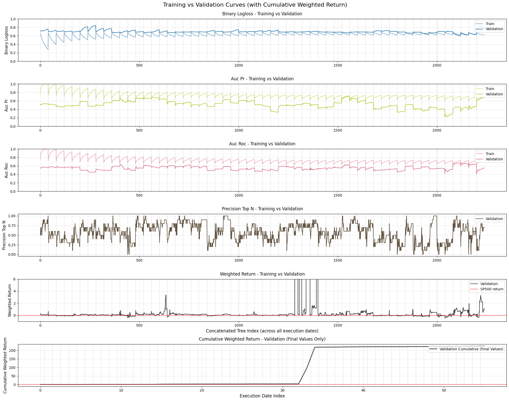
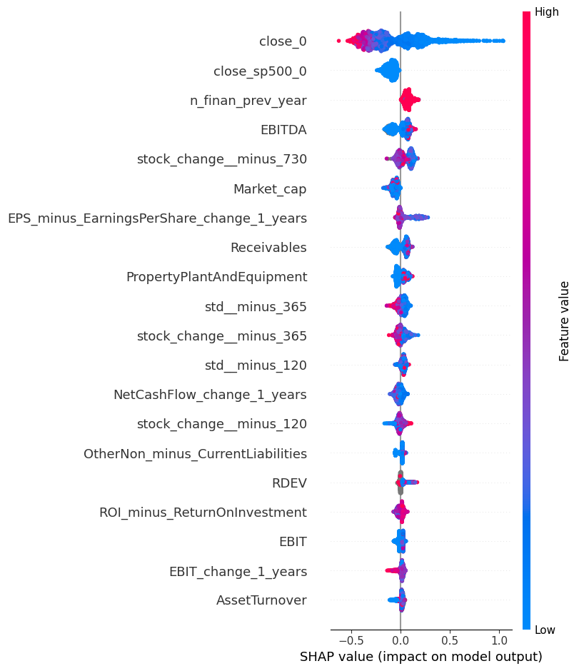
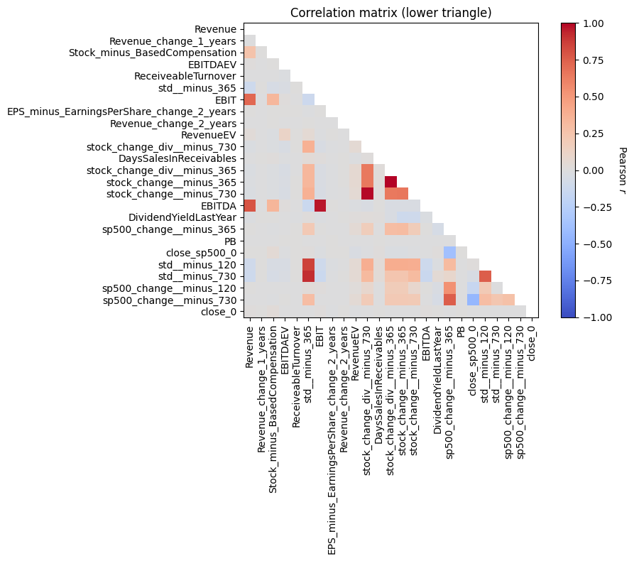

# Model Analysis, Diagnosis and Improvement in Financial Prediction

[](https://www.python.org/downloads/)
[](https://lightgbm.readthedocs.io/)
[](https://shap.readthedocs.io/)
[](https://scikit-learn.org/)

This module focuses on the critical phase that follows model training: **analyzing, diagnosing, and systematically improving machine learning models**. Working with a complex financial dataset to predict stock outperformance against the S&P 500, we demonstrate advanced techniques for model interpretation, identifying data leakage, and implementing strategic improvements.

## 🎯 Business Problem Context

We're building a portfolio selection system that identifies the **top 10 tickers** most likely to outperform the S&P 500 over the following year. The challenge involves:

- **Binary Classification**: Predict if `stock_change_div_365 - sp500_change_365 > 0`
- **Walk-Forward Validation**: Quarterly rebalancing with 36 quarters of training data
- **Business Metric**: Weighted return of selected portfolio vs. simple accuracy
- **High Stakes**: Wrong predictions lead to underperformance in live trading

### Key Dataset Features
- **170,483 observations** across 64 quarterly execution dates (2005-2021)
- **145+ features**: Financial fundamentals + technical indicators
- **Complex temporal structure**: Quarterly company reports with varying release dates
- **Target imbalance**: ~47% positive class (stocks outperforming S&P 500)

## 📊 Comprehensive Model Diagnostics

### Training Curves Analysis: Detecting Overfitting Patterns

My **concatenated training curves visualization** reveals critical insights across all walk-forward models:



**Key Findings:**
- **Early models (2005-2008)**: Perfect training fit with poor validation performance
- **Systematic overfitting**: Log-loss decreases on training but increases on validation
- **Inconsistent AUC patterns**: Models fail to generalize across different market conditions
- **Business metric instability**: Extreme spikes indicating reliance on outlier stocks

### Model Behavior Patterns

**Training Performance Evolution:**
- Initial execution dates show **perfect training fit** (log-loss → 0.2)
- Later models struggle more, possibly due to:
  - Large `N_TRAIN_QUARTERS` (36) causing distribution shift
  - Increased market complexity over time
  - Feature relationships becoming non-stationary

**Validation Concerns:**
- Clear **bias-variance trade-off** issues
- Models memorize training patterns rather than learning generalizable rules
- Custom business metrics show random walk behavior on validation

## 🔍 Critical Data Leakage Discovery

### Feature Importance Investigation

Initial feature importance analysis revealed a **major data leakage issue**:

```python
# Feature importance across all models showed concerning pattern
top_features = get_top_n_features_across_models(20, all_models)
# sp500_change_730 appeared as most important feature
```

**The Problem**: `sp500_change_730` was included in training data, but represents **future S&P 500 performance** relative to the execution date - a classic example of data leakage.

**Impact**: Models were essentially "cheating" by using future information to predict future performance.

**Solution**: Immediate removal from feature set and model retraining.

## 🧠 SHAP Analysis: Deep Model Interpretation

### Unveiling the `close_0` Dependency

Our SHAP analysis revealed that models were making predictions based on a **counterintuitive pattern**:



**Key Discovery**: The `close_0` (stock price at execution) feature showed:
- **Strong negative correlation** with prediction probability
- **Lower-priced stocks** consistently received higher outperformance probabilities
- This created a **"penny stock bias"** in the model

### SHAP Insights Breakdown

```python
# SHAP analysis showed clear pattern
shap.summary_plot(shap_values, date_df)
# close_0 dominated feature importance
# Low values → High prediction probability
# High values → Low prediction probability
```

**Business Logic Concern**: While statistically valid (small-cap stocks can outperform), this pattern suggested the model was:
1. **Over-relying on market cap effects** rather than fundamental analysis
2. **Susceptible to volatility** in small-cap stocks
3. **Missing deeper financial relationships**

## ⚡ Strategic Model Improvements

### 1. Regularization and Overfitting Mitigation

**Hyperparameter Optimization:**
```python
model_params = {
    "learning_rate": 0.01,        # Reduced from default
    "max_depth": 6,               # Limited tree depth
    "feature_fraction": 0.7,      # Feature subsampling
    "bagging_fraction": 0.8,      # Row subsampling
    "early_stopping_rounds": 10   # Prevent overfitting
}
```

**Training Period Reduction:**
- Reduced `N_TRAIN_QUARTERS` from 36 to 16 (4 years)
- Improved model stability and reduced distribution shift

### 2. Principal Component Analysis (PCA) for Feature Engineering



The correlation matrix analysis revealed distinct **feature families** with high internal correlation:

**Identified Correlated Feature Groups:**
- **S&P 500 Trends** (high correlation 0.7-0.9): `sp500_change_minus_730`, `sp500_change_minus_365`, `sp500_change_minus_120`
- **Volatility Measures** (high correlation 0.8-0.95): `std_minus_730`, `std_minus_365`, `std_minus_120`
- **Stock Performance Indicators**: Various `stock_change` variables showing temporal correlation
- **Financial Fundamentals**: Revenue, EBITDA, and profitability metrics

**Strategic PCA Implementation by Feature Groups:**

```python
# Group-specific PCA pipelines based on correlation analysis
pca_pipelines = {
    "sp500_trend_pc": Pipeline([
        ("scale", StandardScaler()),
        ("pca", PCA(n_components=1))  # 67.44% variance explained
    ]),
    "volatility_pc": Pipeline([
        ("impute", SimpleImputer(strategy="mean")),
        ("scale", StandardScaler()),
        ("pca", PCA(n_components=1))  # 91.13% variance explained
    ]),
    "stock_change_trend_pc": Pipeline([
        ("impute", SimpleImputer(strategy="mean")),
        ("scale", StandardScaler()),
        ("pca", PCA(n_components=2))  # 67.05% + 22.38% variance explained
    ]),
    "profitability_pc": Pipeline([
        ("impute", SimpleImputer(strategy="mean")),
        ("scale", StandardScaler()),
        ("pca", PCA(n_components=1))  # 83.93% variance explained
    ])
}
```

**Rationale for Group-Based PCA:**
- **Reduces multicollinearity** while preserving interpretability
- **Captures temporal patterns** in each feature family
- **Maintains business logic** by keeping related features together
- **Improves model stability** by reducing redundant information

### 3. Market Cap Filtering Strategy

**Addressing the Penny Stock Bias:**
- Applied market cap threshold: `MARKET_CAP_THRESHOLD = 1e3`
- Removed low-capitalization stocks that created artificial outperformance signals
- **Result**: More stable, realistic model predictions

## 📈 Performance Improvements

### Baseline Comparison Strategy

Implemented multiple baseline strategies to validate model effectiveness:

| Strategy | Cumulative Return | Description |
|----------|------------------|-------------|
| **LightGBM Model** | 3.79 | Our optimized model |
| **Market Cap Strategy** | 1.01 | Select highest market cap stocks |
| **Random Strategy** | 4.78 | Random selection (high variance) |
| **Momentum Strategy** | 81.29 | Select stocks with highest recent performance |

**Key Insight**: The momentum strategy's exceptional performance highlighted the importance of **trend-following signals** in financial markets.

### Training Curve Improvements

**Before Optimization:**
- Severe overfitting across all time periods
- Unstable validation metrics
- Business metric showing random behavior

**After Optimization:**
- **Converged training and validation curves**
- Stable performance across different market conditions
- Early stopping effectively prevented overfitting
- More consistent business metric performance

## 🔧 Advanced Techniques Implemented

### 1. Custom Evaluation Metrics

```python
def precision_top_n(preds, train_data):
    """Precision for top N predicted stocks"""
    top_dataset = get_top_tickers_per_prob(preds)
    labels = top_dataset["target"]
    return "precision-top-n", np.sum(labels)/len(labels), True

def weighted_return_metric(preds, train_data):
    """Business-aligned metric for portfolio performance"""
    top_dataset = get_top_tickers_per_prob(preds)
    return "weighted-return", 
           get_weighted_performance_of_stocks(top_dataset, "diff_ch_sp500"), True
```

### 2. Correlation Analysis and Feature Selection

- **Systematic correlation analysis** of top features
- **Feature group identification** (S&P trends, volatility, profitability)
- **Dimensionality reduction** while preserving interpretability

### 3. SHAP-Based Feature Validation

- **Global feature importance** across all models
- **Individual prediction explanations** for key decisions
- **Feature interaction analysis** to understand model behavior

## 💡 Key Insights and Learnings

### Technical Discoveries

1. **Data Leakage Detection**: Critical importance of temporal feature validation
2. **Overfitting Patterns**: Complex models can memorize rather than generalize
3. **Feature Engineering**: PCA can improve stability while maintaining interpretability
4. **Business Metrics**: Domain-specific metrics often reveal issues that standard metrics miss

### Financial Modeling Insights

1. **Market Cap Effects**: Small-cap bias can create misleading performance signals
2. **Temporal Stability**: Financial relationships change over time, requiring adaptive approaches
3. **Baseline Validation**: Simple strategies (momentum) can outperform complex models
4. **Risk-Return Trade-offs**: Model complexity doesn't always translate to better business outcomes

### Methodological Breakthroughs

1. **Comprehensive Diagnostics**: Systematic approach to model analysis prevents deployment of flawed models
2. **SHAP Integration**: Model interpretability is crucial for financial applications
3. **Walk-Forward Validation**: Essential for temporal data to avoid lookahead bias
4. **Multi-Metric Evaluation**: Different metrics reveal different aspects of model performance

## 🚀 Implementation Architecture

### Model Training Pipeline

```python
def train_model_with_diagnostics(train_set, test_set, model_params, pca_pipelines):
    # Feature engineering with PCA
    X_train = add_pcs(train_set, pca_pipelines, fit=True)
    X_test = add_pcs(test_set, pca_pipelines, fit=False)
    
    # Model training with early stopping
    model = lgb.train(
        params=model_params,
        train_set=lgb_train,
        valid_sets=[lgb_test, lgb_train],
        callbacks=[lgb.early_stopping(10)]
    )
    
    # SHAP analysis for interpretability
    explainer = shap.Explainer(model)
    shap_values = explainer.shap_values(X_test)
    
    return model, shap_values
```

### Diagnostic Visualization

```python
def plot_concatenated_training_curves(results, metrics):
    """Visualize training curves across all walk-forward models"""
    # Concatenate results from all execution dates
    # Plot training vs validation for each metric
    # Highlight overfitting patterns and model stability
```


## 🔮 Next Steps

This diagnostic framework establishes the foundation for:
- **Module 6**: Business translation and stakeholder communication
- **Module 7**: Production system design and deployment
- **Advanced MLOps**: Model monitoring and drift detection in production

---

*"The best models are not just accurate—they are interpretable, robust, and aligned with business objectives. Comprehensive diagnostics separate successful deployments from costly failures."*