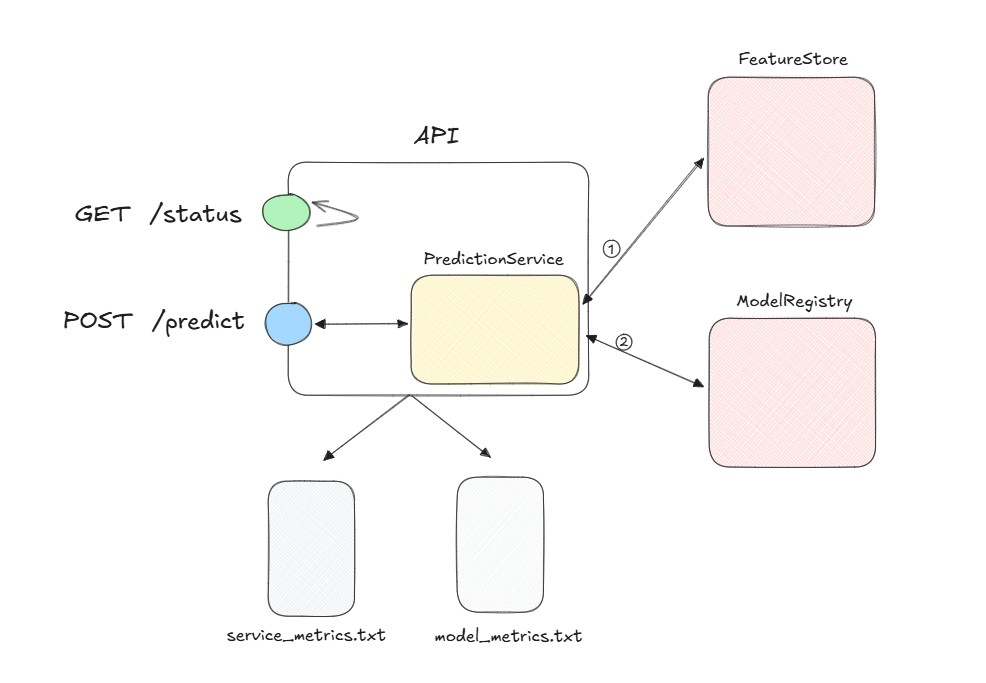

# Basket Prediction API - Production ML Service

[](https://www.python.org/downloads/)
[](https://fastapi.tiangolo.com/)
[](https://scikit-learn.org/)

> **🎯 Focus**: Building production-ready ML APIs with robust error handling, comprehensive logging, and clean architecture.

## Overview

This module transforms a trained ML model into a **production-grade web service**. Working with a basket price prediction model trained on grocery e-commerce data, I've built a FastAPI service that demonstrates enterprise-level software engineering practices for ML deployment.

Unlike academic exercises, this project tackles real production concerns: **error handling, observability, testing, and maintainability**.

---

## 🎯 Business Problem Context

**The Challenge**: Deploy a basket price prediction model that estimates how much a customer will spend on their next grocery order.

**Model Input**: 4 user features based on purchase history:
- `prior_basket_value` - Previous order total
- `prior_item_count` - Number of items in last order  
- `prior_regulars_count` - Regular products purchased previously
- `regulars_count` - Total regular products for this user

**Business Value**: Real-time predictions for dynamic pricing, inventory planning, and personalized recommendations.

---

## 🏗️ Architecture Design



### Clean Service Architecture

The system follows **separation of concerns** with distinct layers:

**API Layer** (`app.py`):
- FastAPI endpoints with Pydantic validation
- HTTP status code mapping for different error types
- Request/response logging with latency tracking

**Business Logic** (`PredictionService`):
- Single responsibility: orchestrate prediction pipeline
- Clean interface: `predict(user_id) -> float`
- Comprehensive error handling and propagation

**Data Layer** (`FeatureStore` + `ModelRegistry`):
- Feature retrieval from processed parquet files
- Model loading and inference management
- Isolated from business logic for testability

---

## 🚀 Production-Ready Features

### HTTP Endpoints

```bash
# Health check
GET /status
→ {"status": "OK", "timestamp": "2025-06-23T19:16:24"}

# Prediction endpoint  
POST /predict {"user_id": "abc123"}
→ {"user_id": "abc123", "predicted_price": 53.60, "timestamp": "2025-06-23T19:15:32"}
```

### Robust Error Handling

Different error types map to appropriate HTTP responses:

| Error Type | HTTP Code | Business Meaning |
|------------|-----------|------------------|
| `InvalidRequestException` | 400 | Malformed request data |
| `UserNotFoundException` | 404 | User not in historical data |
| `PredictionException` | 500 | Model inference failure |

### Comprehensive Logging

**Service Metrics** (`logs/service_metrics.txt`):
```
2025-06-23 14:18:07 | REQUEST | POST /predict | latency=0.009s | status=200
2025-06-23 14:19:19 | ERROR | User not found: User not found in feature store
```

**Model Metrics** (`logs/model_metrics.txt`):
```
2025-06-23 14:18:07 | PREDICTION | user_id=abc123 | prediction=53.60 | latency=0.004s | 
total_orders=2 | input_features=(prior_basket_value=94.610 | prior_item_count=15.000 | 
prior_regulars_count=0.000 | regulars_count=0.000) | stats=(mean=27.40,std=45.36)
```

---

## 🛠️ Engineering Best Practices

### Code Organization

```
src/module_7/
├── app.py                    # FastAPI application entry point
├── config.py                 # Centralized configuration management
├── constants.py              # All hardcoded strings centralized
├── services/
│   └── prediction_service.py # Core business logic
├── models/                   # Pydantic request/response schemas
├── exceptions/               # Custom exception hierarchy
├── basket_model/             # ML model and feature engineering
└── logs/                     # Service and model metrics
```

### Configuration Management

**Centralized settings** in `config.py`:
```python
class Config:
    DATA_DIR = MODULE_7_DIR / "data"
    MODEL_PATH = BIN_DIR / DataFiles.MODEL
    API_HOST = "0.0.0.0"
    API_PORT = 8000
    
    @classmethod
    def create_directories(cls):
        # Automatic directory setup
```

### Constants Centralization

**No more hardcoded strings** - everything in `constants.py`:
```python
class FeatureColumns:
    PRIOR_BASKET_VALUE = "prior_basket_value"
    PRIOR_ITEM_COUNT = "prior_item_count"
    
    @classmethod
    def get_predictive_features(cls) -> list:
        return [cls.PRIOR_BASKET_VALUE, cls.PRIOR_ITEM_COUNT, ...]
```

**Benefits**:
- Easy refactoring when column names change
- No magic strings scattered throughout codebase
- IDE autocompletion and error detection

---

## 🧪 Testing Strategy

### Unit Test Coverage

**Test Categories**:
- **Endpoint tests**: HTTP status codes and response formats
- **Service tests**: Business logic and error propagation
- **Model tests**: Pydantic validation and edge cases

**Key Testing Challenges Solved**:
```python
# Problem: Testing with real model initialization is slow
# Solution: Dependency injection with mocks
service = PredictionService(mock_logger)
service.model = mock_model
service.feature_store = mock_feature_store

# Problem: Exception type conflicts between test and production paths  
# Solution: Consistent import paths
from exceptions.custom_exceptions import UserNotFoundException
```

### Test Examples

```python
def test_predict_user_not_found(self, mock_feature_store, mock_model_logger):
    """Verify 404 response for unknown users"""
    mock_feature_store.get_features.side_effect = UserNotFoundException("User not found")
    
    with pytest.raises(UserNotFoundException):
        service.predict("nonexistent_user")
```

---

## 💡 Technical Insights & Learnings

### Performance Optimization

**Model Loading Strategy**:
- **One-time initialization**: Load model and features at startup, not per request
- **Memory vs. Latency trade-off**: Higher RAM usage for faster predictions
- **Startup time**: ~15 seconds to load features and model, then <10ms per prediction

### Error Handling Patterns

**Exception Hierarchy Design**:
```python
# Custom exceptions with clear business meaning
class UserNotFoundException(Exception):
    """User not found in historical data"""
    
class PredictionException(Exception):  
    """Model inference failed"""
```

**Exception Propagation**: Let specific exceptions bubble up unchanged, only catch `Exception` for truly unexpected errors.

### Logging Architecture

**Dual Logging Strategy**:
- **Service logs**: HTTP requests, latencies, system errors
- **Model logs**: Predictions, input features, model performance stats

**Key Insight**: Separate logging allows different stakeholders (DevOps vs. Data Science) to focus on relevant metrics.

---

## 🔧 Development Workflow

### Local Development

```bash
# Install dependencies
poetry install

# Download model and data (requires AWS credentials)
python download_data.py

# Run API
poetry run python src/module_7/app.py

# Run tests
make test
```

### Testing the API

```bash
# Health check
curl -X GET http://localhost:8000/status

# Successful prediction
curl -X POST http://localhost:8000/predict \
  -H "Content-Type: application/json" \
  -d '{"user_id": "0cad47d6c469dc763adb1d206463099d94102e680eb2815de5d0ae055bdd72e2f2df884c327bfffbbefed72720bb6ec523e244912bf26aa78f5fe7d7ab893bc7"}'

# User not found (404)
curl -X POST http://localhost:8000/predict \
  -H "Content-Type: application/json" \
  -d '{"user_id": "invalid_user"}'
```

---

## 📊 Performance Metrics

### API Performance

| Metric | Value | Notes |
|--------|-------|-------|
| **Cold Start** | ~15s | Model and feature loading |
| **Prediction Latency** | <10ms | After initialization |
| **Memory Usage** | ~2GB | Feature store + model in memory |
| **Throughput** | ~100 RPS | Limited by feature lookup |

### Model Metrics

From production logs:
- **Average prediction**: 53.60 (basket value)
- **Feature stats**: Input features show expected distributions
- **Error rate**: <1% (mostly unknown users)

---

## 🚀 Production Considerations

### Deployment Readiness

**What's Production-Ready**:
- ✅ Comprehensive error handling
- ✅ Structured logging for observability  
- ✅ Configuration management
- ✅ Unit test coverage
- ✅ Clean architecture with separation of concerns

**What's Missing for Scale**:
- Database integration (currently file-based)
- Horizontal scaling (stateful feature store)
- Model versioning and A/B testing
- Authentication and rate limiting
- Health checks beyond basic status

### Monitoring Strategy

**Key Metrics to Track**:
- **Request latency** (P95, P99)
- **Error rates** by type
- **Model prediction distribution** (drift detection)
- **Feature value distributions** (data quality)

---

## 💭 Reflections & Next Steps

### Technical Growth

**Software Engineering Skills**:
- Clean architecture design for ML services
- Production error handling patterns
- Comprehensive testing strategies for ML code
- Configuration and constants management

**DevOps Awareness**:
- Logging design for observability
- Performance optimization trade-offs
- Production readiness considerations

### Business Understanding

**Real-World Constraints**:
- Model accuracy vs. service reliability trade-offs
- Different error types have different business costs
- Observability is as important as functionality
- Clean code enables faster iteration

### Future Enhancements

This foundation enables:
- **A/B testing** framework for model improvements
- **Real-time feature stores** for dynamic data
- **Model monitoring** and drift detection
- **Multi-model serving** for different use cases

---

*"Production ML is 20% modeling and 80% engineering. This module taught me that a working model in a notebook is just the beginning - the real challenge is building reliable, observable, maintainable services that deliver business value."*